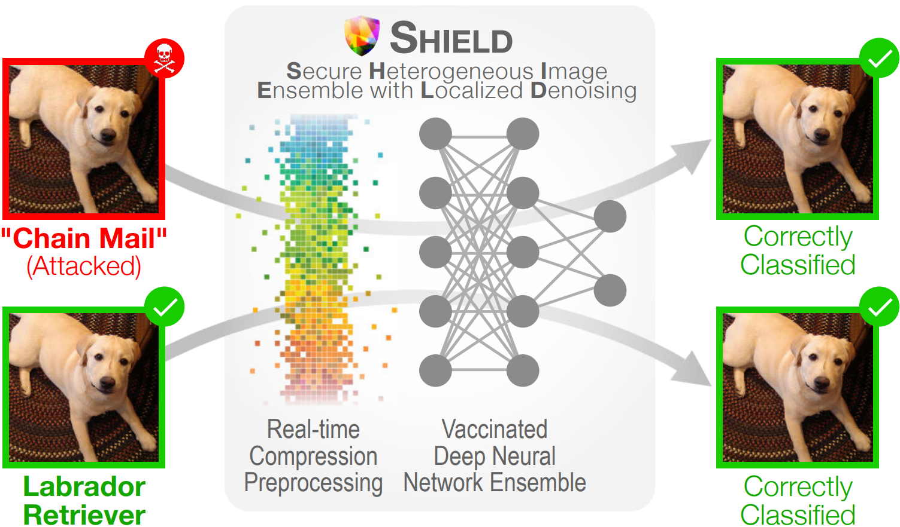

# SHIELD: Fast, Practical Defense and Vaccination for Deep Learning using JPEG Compression

## Overview

This is the code repository for the accepted [KDD 2018](http://www.kdd.org/kdd2018/) Applied Data Science paper: **[SHIELD: Fast, Practical Defense and Vaccination for Deep Learning using JPEG Compression](https://arxiv.org/abs/1802.06816)**. Visit our research group homepage [Polo Club of Data Science](https://poloclub.github.io) at [Georgia Tech](http://www.gatech.edu) for more related research!

The code included here reproduces our techniques (e.g. SHIELD) presented in the paper, and also our experiment results reported, such as using various JPEG compression qualities to remove adversarial perturbation introduced by Carlini-Wagner-L2, DeepFool, I-FSGM, and FSGM.




## Research Abstract and Contributions
The rapidly growing body of research in adversarial machine learning has demonstrated that deep neural networks (DNNs) are highly vulnerable to adversarially generated images. This underscores the urgent need for practical defense that can be readily deployed to combat attacks in real-time. Observing that many attack strategies aim to perturb image pixels in ways that are visually imperceptible, we place JPEG compression at the core of our proposed Shield defense framework, utilizing its capability to effectively "compress away" such pixel manipulation. To immunize a DNN model from artifacts introduced by compression, Shield "vaccinates" a model by re-training it with compressed images, where different compression levels are applied to generate multiple vaccinated models that are ultimately used together in an ensemble defense. On top of that, Shield adds an additional layer of protection by employing randomization at test time that compresses different regions of an image using random compression levels, making it harder for an adversary to estimate the transformation performed. This novel combination of vaccination, ensembling, and randomization makes Shield a fortified multi-pronged protection. We conducted extensive, large-scale experiments using the ImageNet dataset, and show that our approaches eliminate up to 94% of black-box attacks and 98% of gray-box attacks delivered by the recent, strongest attacks, such as Carlini-Wagner's L2 and DeepFool. Our approaches are fast and work without requiring knowledge about the model.


## Installation and Setup

### Install Dependencies

This repository requires [Cleverhans](https://github.com/tensorflow/cleverhans) and [TensorFlow-Slim image classification model library](https://github.com/tensorflow/models/tree/master/research/slim), please see their respective pages for instructions for installation.

> Note: When installing [TF-slim image models library](https://github.com/tensorflow/models/tree/master/research/slim), find `models/research/slim`, and put directory `slim` under `utils`. So that your directory structure should contain `utils/slim`.

### Config Home Directory

In `constants.py`, fill in the home directory of your choice.

```python
HOME_DIR = '' # eg. '/home/yourusername/'
```

## Example usage:

The script orchestrator.py can be used to perform (specified using --perform attack\|defend\|evaluate)

1. attack - Attacks the specified model with the specified method(s)
2. defend - Defends the specified attack images with the specified defense
3. evaluate - Evaluates the specified model with the specified defended version of images.

```bash
python orchestrator.py --use_gpu 0 --debug false --perform attack --models resnet_50_v2 --attacks fgsm,df
```

```bash
python orchestrator.py --use_gpu 0 --debug true --perform evaluate --models resnet_50_v2 --checkpoint_paths /home/.../model.ckpt --attacks fgsm --defenses jpeg --attack_ablations '{"fgsm": [{"ord": Infinity, "eps": 2}]}' --defense_ablations '{"jpeg": [{"quality": 60}]}'
```

## Video Demo
[](https://youtu.be/W119nXS4xGE)


## Paper PDF on arXiv
[](https://arxiv.org/abs/1802.06816)

## Citation 

**SHIELD: Fast, Practical Defense and Vaccination for Deep Learning using JPEG Compression.**  
Nilaksh Das, Madhuri Shanbhogue, Shang-Tse Chen, Fred Hohman, Siwei Li, Li Chen, Michael E. Kounavis, Duen Horng Chau.  
*ACM SIGKDD Conference on Knowledge Discovery and Data Mining (KDD) 2018*. London, UK. Aug 19-23, 2018.

### BibTeX
```
@article{das2018shield, 
   title={SHIELD: Fast, Practical Defense and Vaccination for Deep Learning using JPEG Compression}, 
   author={Das, Nilaksh and Shanbhogue, Madhuri and Chen, Shang-Tse and Hohman, Fred and Li, Siwei and Chen, Li and Kounavis, Michael E and Chau, Duen Horng}, 
   booktitle={Proceedings of the 24nd ACM SIGKDD International Conference on Knowledge Discovery and Data Mining}, 
   year={2018}, 
   organization={ACM} 
}
```


## Researchers

|  Name                 | Affiliation                     |
|-----------------------|---------------------------------|
| [Nilaksh Das](http://nilakshdas.com)           | Georgia Tech |
| [Madhuri Shanbhogue](https://www.linkedin.com/in/madhuri-shanbhogue/)    | Georgia Tech |
| [Shang-Tse Chen](https://www.cc.gatech.edu/~schen351/)        | Georgia Tech |
| [Fred Hohman](http://fredhohman.com)           | Georgia Tech |
| [Siwei Li](https://rsli.github.io)              | Georgia Tech |
| [Li Chen](https://www.linkedin.com/in/li-chen-phd-b2a10289/)               | Intel Corporation               |
| [Michael E. Kounavis](https://www.linkedin.com/in/michael-kounavis-5bbb599/)   | Intel Corporation               |
| [Polo Chau](https://www.cc.gatech.edu/~dchau/)             | Georgia Tech |
