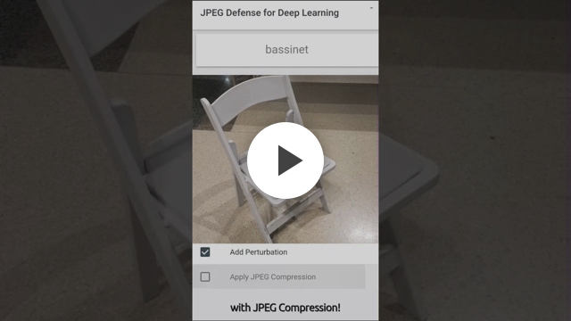

# SHIELD: Fast, Practical Defense and Vaccination for Deep Learning using JPEG Compression


## Overview

This is the code repository for the [KDD 2018](http://www.kdd.org/kdd2018/) Applied Data Science paper: **[SHIELD: Fast, Practical Defense and Vaccination for Deep Learning using JPEG Compression](https://arxiv.org/abs/1802.06816)**. Visit our research group homepage [Polo Club of Data Science](https://poloclub.github.io) at [Georgia Tech](http://www.gatech.edu) for more related research!

The code included here reproduces our techniques (e.g. SLQ) presented in the paper, and also our experiment results reported, such as using various JPEG compression qualities to remove adversarial perturbation introduced by Carlini-Wagner-L2, DeepFool, I-FSGM, and FSGM.

[](https://youtu.be/zUB2-i7rSb4)


## Research Abstract
The rapidly growing body of research in adversarial machine learning has demonstrated that deep neural networks (DNNs) are highly vulnerable to adversarially generated images. 
This underscores the urgent need for practical defense that can be readily deployed to combat attacks in real-time. 
Observing that many attack strategies aim to perturb image pixels in ways that are visually imperceptible, we place JPEG compression at the core of our proposed SHIELD defense framework, utilizing its capability to effectively "compress away" such pixel manipulation. 
To immunize a DNN model from artifacts introduced by compression, SHIELD "vaccinates" a model by re-training it with compressed images, where different compression levels are applied to generate multiple vaccinated models that are ultimately used together in an ensemble defense. 
On top of that, SHIELD adds an additional layer of protection by employing randomization at test time that compresses different regions of an image using random compression levels, making it harder for an adversary to estimate the transformation performed. 
This novel combination of vaccination, ensembling, and randomization makes SHIELD a fortified, multi-pronged defense. 
We conducted extensive, large-scale experiments using the ImageNet dataset, and show that our approaches eliminate up to 94% of black-box attacks and 98% of gray-box attacks delivered by the recent, strongest techniques, such as Carlini-Wagner's L2 and DeepFool. 
Our approaches are fast and work without requiring knowledge about the model.


## Installation and Setup

### Clone Repository

To clone this repository using `git`, simply run the following command:

```bash
git clone https://github.com/poloclub/jpeg-defense.git
```

### Install Dependencies

This repository uses attacks from the [CleverHans](https://github.com/tensorflow/cleverhans) library, and the models are adapted from [tf-slim](https://github.com/tensorflow/models/tree/master/research/slim). We also use [Sacred](https://github.com/IDSIA/sacred) to keep track of the experiments.
All dependencies for this repository can be found in `requirements.txt`. To install these dependencies, run the following command from the `jpeg-defense` directory:
```bash
pip install -r requirements.txt
```

### Setup ImageNet Dataset

The code expects the ImageNet validation dataset to be available in TFRecord format in the `data/validation` directory.
To provision the data, we have provided a script (`setup/get_imagenet.py`) that downloads, processes, and saves the entire ImageNet dataset in the required format.
This script can be run from the `setup` directory in the following manner:

```bash
python get_imagenet.py --local_scratch_dir="/path/to/jpeg-defense/data"
``` 

Downloading the entire dataset from the ImageNet website using this script may be very slow.
Optionally, we recommend downloading the 
[`ILSVRC2012_img_train.tar`](http://academictorrents.com/details/a306397ccf9c2ead27155983c254227c0fd938e2) 
and [`ILSVRC2012_img_val.tar`](http://academictorrents.com/details/5d6d0df7ed81efd49ca99ea4737e0ae5e3a5f2e5)
using [Academic Torrents](http://academictorrents.com/), and placing these files into the `data/raw_data` directory.
Then, you can run the following command to skip downloading the dataset and proceed with converting the data into TFRecord format:

```bash
python get_imagenet.py \
  --local_scratch_dir="/path/to/jpeg-defense/data" \
  --provision_only=True
```

### Download Pre-trained Model Weights
This repository currently supports the [ResNet50-v2](https://arxiv.org/abs/1603.05027) and [Inception-v4](https://arxiv.org/abs/1602.07261) models from [tf-slim](https://github.com/tensorflow/models/tree/master/research/slim).
Running the following command from the `jpeg-defense` directory will download the pre-trained `.ckpt` files for these models into the `data/checkpoints` folder using the provided `setup/get_model_checkpoints.sh` script:

```bash
bash setup/get_model_checkpoints.sh data/checkpoints
```


## Example Usage

The **`main.py`** script in the `shield` package can be used to perform all the experiments using the `--perform=attack|defend|evaluate` flags.

- *attack* - Attacks the specified model with the specified method and its parameters (see `shield/opts.py`).

```bash
python main.py with \                               
  perform=attack \
  model=resnet_50_v2 \
  attack=fgsm \
  attack_options="{'eps': 16}"
```

- *defend* - Defends the specified attacked images with the specified defense and its parameters (see `shield/opts.py`).
The defense uses the attack parameters only to determine which images are loaded for preprocessing,
as these parameters are not used by the preprocessing itself.

```bash
python main.py with \                               
  perform=defend \
  model=resnet_50_v2 \
  attack=fgsm \
  attack_options="{'eps': 16}" \
  defense=jpeg \
  defense_options="{'quality': 80}"
```

- evaluate - Evaluates the specified model with the specified attacked/defended version of the images.

```bash
python main.py with \                               
  perform=evaluate \
  model=resnet_50_v2 \
  attack=fgsm \
  attack_options="{'eps': 16}"
```


## Video Demo
[](https://youtu.be/W119nXS4xGE)


## Paper PDF on arXiv
[](https://arxiv.org/abs/1802.06816)

## Citation 

**SHIELD: Fast, Practical Defense and Vaccination for Deep Learning using JPEG Compression.**  
Nilaksh Das, Madhuri Shanbhogue, Shang-Tse Chen, Fred Hohman, Siwei Li, Li Chen, Michael E. Kounavis, Duen Horng Chau.  
*ACM SIGKDD Conference on Knowledge Discovery and Data Mining (KDD) 2018*. London, UK. Aug 19-23, 2018.

### BibTeX
```
@article{das2018shield, 
   title={SHIELD: Fast, Practical Defense and Vaccination for Deep Learning using JPEG Compression}, 
   author={Das, Nilaksh and Shanbhogue, Madhuri and Chen, Shang-Tse and Hohman, Fred and Li, Siwei and Chen, Li and Kounavis, Michael E and Chau, Duen Horng}, 
   booktitle={Proceedings of the 24nd ACM SIGKDD International Conference on Knowledge Discovery and Data Mining}, 
   year={2018}, 
   organization={ACM} 
}
```


## Researchers

|  Name                 | Affiliation                     |
|-----------------------|---------------------------------|
| [Nilaksh Das](http://nilakshdas.com)           | Georgia Tech |
| [Madhuri Shanbhogue](https://www.linkedin.com/in/madhuri-shanbhogue/)    | Georgia Tech |
| [Shang-Tse Chen](https://www.cc.gatech.edu/~schen351/)        | Georgia Tech |
| [Fred Hohman](http://fredhohman.com)           | Georgia Tech |
| [Siwei Li](https://rsli.github.io)              | Georgia Tech |
| [Li Chen](https://www.linkedin.com/in/li-chen-phd-b2a10289/)               | Intel Corporation               |
| [Michael E. Kounavis](https://www.linkedin.com/in/michael-kounavis-5bbb599/)   | Intel Corporation               |
| [Polo Chau](https://www.cc.gatech.edu/~dchau/)             | Georgia Tech |
